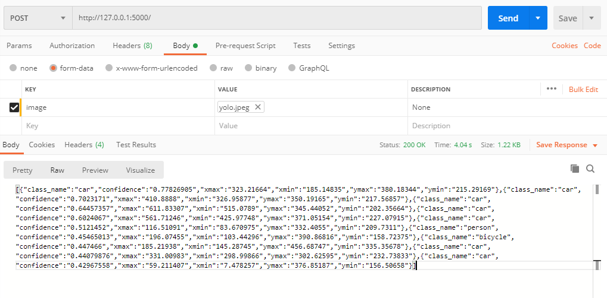

# YOLO V2
## This repository contains an implementation of YOLO v2 along with a simple to use API (made in flask). Download the model data from [here](https://drive.google.com/file/d/1ziKZAD-lG46R0-ZuaaGBIvKXrLvqM1uG/view?usp=sharing).

### Steps to use 
* Clone the repository
* install the dependencies using the requirements.txt file.
* Copy the model data (keras .h5 file) into the model_data directory
* Run from the command line using "python api.py"
* Send a post request to the base url with the body having the id field set to "image" and attach the required image.
* The server will return a json object containing the coordinates, confidence and classes of the found object.

## For example I will use the following image to send a post request to the server. You can easily send post requests using [postman](https://www.postman.com/).

## The server will return the JSON object. It looks like this :

